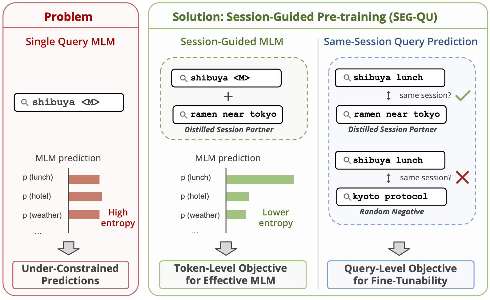

# SEGQU

This repository contains materials developed by LY Corporation and is temporarily open-sourced as the official implementation of our EMNLP 2026 Industry Track paper.

- **Temporary Release**: This repository is temporarily available as open-source. Therefore this repository may be turn into read-only or private anytime.
- **Attribution**: All code and materials in this repository are owned by LY Corporation.

## Project Overview

This repository is the official implementation of our EMNLP 2026 Industry Track paper, **"Session-Guided Pre-training for Query Understanding: Constraining Mask Prediction and Improving Query Fine-tunability."**

Search queries lack sufficient context for effective masked language modeling (MLM). SEGQU addresses this problem by using reliable query pairs distilled from search sessions as distributional context and jointly optimizing Session-Guided MLM and Same-Session Query Prediction.

This repository provides an implementation for training SEGQU and evaluation scripts for the Japanese subset of the public ESCI benchmark. SEGQU is referred to as “SEG-QU” in the paper.



If you use this repository, please cite:

```bibtex
@inproceedings{nishikawa-segqu-2026,
  title = "Session-Guided Pre-training for Query Understanding: Constraining Mask Prediction and Improving Query Fine-tunability",
  booktitle = "Proceedings of the 2026 Conference on Empirical Methods in Natural Language Processing: Industry Track",
  year = "2026",
  publisher = "Association for Computational Linguistics",
}
```

## Installation and Usage

### Installation

Python **3.10+** required.

```bash
pip install -e .
```

### Pre-training

Prepare a sessionized, paired, filtered, and deduplicated JSONL file with one
`queries` array per line:

```json
{"queries":["shibuya lunch","ramen near tokyo"]}
```

Preprocess the query pairs and train SEGQU with the same ModernBERT checkpoint:

```bash
segqu-preprocess \
  --input data/query_pairs.jsonl \
  --output-dir processed/segqu \
  --model-name-or-path MODEL_NAME_OR_PATH \
  --objective segqu

segqu-train \
  --processed_data_path processed/segqu \
  --model_name_or_path MODEL_NAME_OR_PATH \
  --output_dir outputs/segqu
```

The preprocessing command also supports `contrastive` and `mlm` objectives.

### Japanese ESCI evaluation

Download the official reduced ESCI examples and products Parquet files, then
run preprocessing, fine-tuning, and evaluation:

```bash
segqu-esci-preprocess \
  --examples data/esci/shopping_queries_dataset_examples.parquet \
  --products data/esci/shopping_queries_dataset_products.parquet \
  --output-dir data/esci/processed

segqu-esci-train \
  --train_file data/esci/processed/train.jsonl \
  --dev_file data/esci/processed/dev.jsonl \
  --model_name_or_path outputs/segqu \
  --output_dir outputs/segqu-esci

segqu-esci-evaluate \
  --data-file data/esci/processed/test.jsonl \
  --model-dir outputs/segqu-esci \
  --output-dir outputs/segqu-esci/test
```

## Contributions
 
As this project is temporarily open-sourced, we are not accepting contributions. For feedback or inquiries, please open an issue in this repository.

## License

This code is dedicated to the public domain under [CC0 1.0](https://creativecommons.org/publicdomain/zero/1.0/). You may copy, modify, and distribute it without restriction, and the authors make no warranties or guarantees regarding its use.
